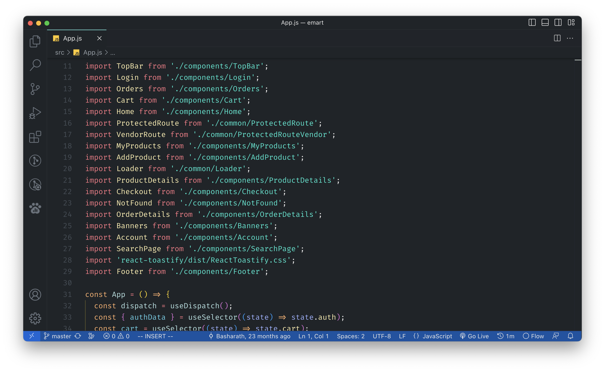

# Gladiator Theme for VS Code

A simple dark cool theme for VS Code.

### To install
1. Goto [VS marketplace](https://marketplace.visualstudio.com/items?itemName=Basharath.gladiator-theme).
2. Click on Install button

----

## Theme Preview

---

> If you like the theme share it with your friends.

> You can send your feedback through [Twitter](https://twitter.com/hashBender)

> Source: https://github.com/Basharath/gladiator-theme